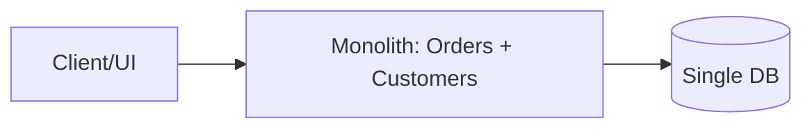
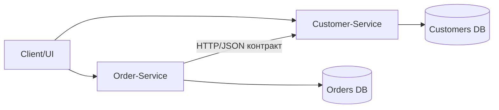

# Лабораторна робота: Моделювання та контракти сервісів (ASP.NET)

Виконав аспірант групи 25_F3_A Тютюнник Петро Богданович

## 1. Обгрунтування декомпозиції моноліту

### Моноліт (до декомпозиції)


### Декомпозиція на сервіси


### Аналіз cohesion/coupling
- Cohesion (зв'язність всередині модуля):
  Order-Service має сфокусовану відповідальність: створення замовлень, статус, історія.
  Customer-Service має окрему відповідальність: профіль, контакти, адреса.
- Coupling (зчеплення між модулями):
  Замість прямого внутрішнього виклику функцій моноліту використовується явний HTTP-контракт.
  Це зменшує структурну залежність і дозволяє незалежні релізи.
- Причина декомпозиції:
  У моноліті зміни в моделі Customer часто ламали Order-логіку під час спільного деплою.
  У SOA/мікросервісному підході ризик локалізується контрактом і версіонуванням.

## 2. Сервісні контракти

### Визначені endpoint-и
- Customer-Service:
  - GET /customers/{id}
  - PUT /customers/{id}/address
- Order-Service:
  - POST /orders
  - GET /orders/{id}

### OpenAPI контракт
Повний лістинг наведений у файлі:
- customer_service_contract.yaml

## 3. Мінімальна реалізація та тестування контракту

### Реалізація
- Customer-Service повертає профіль клієнта згідно контракту.

- Order-Service перед фіналізацією замовлення викликає Customer-Service і очікує поле `name`.
```csharp
app.MapPost("/orders", async Task<IResult> (
    CreateOrderRequest request,
    [FromQuery] string? customerApiVersion,
    IHttpClientFactory httpClientFactory) =>
{
    var customerClient = httpClientFactory.CreateClient("CustomerService");
    var version = string.IsNullOrWhiteSpace(customerApiVersion)
        ? "v1"
        : customerApiVersion.Trim().ToLowerInvariant();
    var customerPath = version switch
    {
        "v2" => $"/api/v2/customers/{request.CustomerId}",
        _ => $"/api/v1/customers/{request.CustomerId}"
    };
    // Makes a call to the customer service
    var response = await customerClient.GetAsync(customerPath);
    if (!response.IsSuccessStatusCode)
    {
        return Results.Json(new
        {
            message = "Order-Service could not validate customer data.",
            customerServiceStatus = (int)response.StatusCode
        }, statusCode: StatusCodes.Status502BadGateway);
    }

    var customer = await response.Content.ReadFromJsonAsync<CustomerDto>();
    if (customer is null || string.IsNullOrWhiteSpace(customer.Name))
    {
        return Results.Json(new
        {
            message = "Contract violation: expected field 'name' is missing in Customer-Service response."
        }, statusCode: StatusCodes.Status502BadGateway);
    }

    var orderId = nextOrderId++;
    var newOrder = new Order(
        Id: orderId,
        CustomerId: request.CustomerId,
        Items: request.Items,
        Status: "Finalized",
        ShippingCity: customer.Address.City,
        CreatedAtUtc: DateTime.UtcNow);

    orders[orderId] = newOrder;

    return Results.Created($"/orders/{orderId}", newOrder);
})
```

### Демонстрація порушення контракту
- У Customer-Service додано окрему версію API v2: `GET /api/v2/customers/{id}`, де `name` перейменовано на `fullName`.

- Order-Service при `customerApiVersion=v2` отримує відповідь без очікуваного поля `name` і повертає 502 Bad Gateway з повідомленням про порушення контракту.


## 4. Порівняння REST (OpenAPI) vs SOAP (WSDL)

| Критерій | REST/OpenAPI | SOAP/WSDL |
|---|---|---|
| Формат даних | Зазвичай JSON, компактний і читабельний | XML, більш громіздкий |
| Складність входу | Низька, простий HTTP-модель | Вища, складніша схема та інструментарій |
| Формальна строгость | Гнучка, але залежить від дисципліни команди | Висока формалізація контракту |
| Еволюція API | Легка ітеративна зміна з версіями | Зміни часто дорожчі в супроводі |
| Tooling в мікросервісах | Дуже широка підтримка cloud-native стеків | Частіше в enterprise legacy сценаріях |

## 5. Висновки
- Контракт як закон:
  OpenAPI є єдиною точкою узгодження між командами, які розвивають сервіси незалежно.
- Архітектурний зсув:
  Декомпозиція дозволяє Independent Deployment, але вимагає дисципліни контрактного тестування.
- Роль версіонування:
  Будь-яка несумісна зміна структури (наприклад, `name -> fullName`) повинна йти через нову версію API (наприклад, v2).
- Дослідницька перспектива:
  Формальні методи (типізовані специфікації, SMT-перевірка сумісності схем) для автоматичної валідації backward compatibility між версіями контрактів.

## 6. Де реалізовано
- Customer-Service код: CustomerService/Program.cs
- Order-Service код: OrderService/Program.cs
- OpenAPI контракт: customer_service_contract.yaml
- Демо тесту: contract-test-demo.ps1
