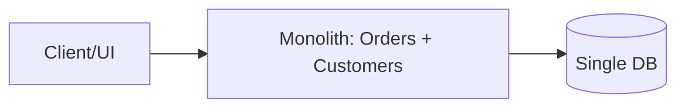
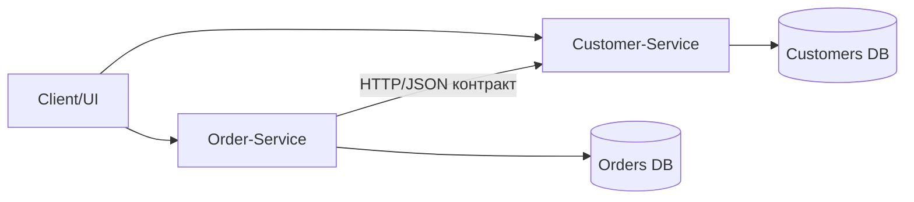

# Лабораторна робота: Моделювання та контракти сервісів (ASP.NET)

## 1. Обгрунтування декомпозиції моноліту

### Моноліт (до декомпозиції)

### Декомпозиція на сервіси

### Аналіз cohesion/coupling
- Cohesion (зв'язність всередині модуля):
  Order-Service має сфокусовану відповідальність: створення замовлень, статус, історія.
  Customer-Service має окрему відповідальність: профіль, контакти, адреса.
- Coupling (зчеплення між модулями):
  Замість прямого внутрішнього виклику функцій моноліту використовується явний HTTP-контракт.
  Це зменшує структурну залежність і дозволяє незалежні релізи.
- Причина декомпозиції:
  У моноліті зміни в моделі Customer часто ламали Order-логіку під час спільного деплою.
  У SOA/мікросервісному підході ризик локалізується контрактом і версіонуванням.

## 2. Сервісні контракти

### Визначені endpoint-и
- Customer-Service:
  - GET /customers/{id}
  - PUT /customers/{id}/address
- Order-Service:
  - POST /orders
  - GET /orders/{id}

### OpenAPI контракт
Повний лістинг наведений у файлі:
- customer_service_contract.yaml

## 3. Мінімальна реалізація та тестування контракту

### Реалізація
- Customer-Service повертає профіль клієнта згідно контракту.
- Order-Service перед фіналізацією замовлення викликає Customer-Service і очікує поле `name`.

### Демонстрація порушення контракту
- У Customer-Service додано окрему версію API v2: `GET /api/v2/customers/{id}`, де `name` перейменовано на `fullName`.
- Order-Service при `customerApiVersion=v2` отримує відповідь без очікуваного поля `name` і повертає 502 Bad Gateway з повідомленням про порушення контракту.

## 4. Порівняння REST (OpenAPI) vs SOAP (WSDL)

| Критерій | REST/OpenAPI | SOAP/WSDL |
|---|---|---|
| Формат даних | Зазвичай JSON, компактний і читабельний | XML, більш громіздкий |
| Складність входу | Низька, простий HTTP-модель | Вища, складніша схема та інструментарій |
| Формальна строгость | Гнучка, але залежить від дисципліни команди | Висока формалізація контракту |
| Еволюція API | Легка ітеративна зміна з версіями | Зміни часто дорожчі в супроводі |
| Tooling в мікросервісах | Дуже широка підтримка cloud-native стеків | Частіше в enterprise legacy сценаріях |

## 5. Висновки
- Контракт як закон:
  OpenAPI є єдиною точкою узгодження між командами, які розвивають сервіси незалежно.
- Архітектурний зсув:
  Декомпозиція дозволяє Independent Deployment, але вимагає дисципліни контрактного тестування.
- Роль версіонування:
  Будь-яка несумісна зміна структури (наприклад, `name -> fullName`) повинна йти через нову версію API (наприклад, v2).
- Дослідницька перспектива:
  Формальні методи (типізовані специфікації, SMT-перевірка сумісності схем) для автоматичної валідації backward compatibility між версіями контрактів.

## 6. Де реалізовано
- Customer-Service код: CustomerService/Program.cs
- Order-Service код: OrderService/Program.cs
- OpenAPI контракт: customer_service_contract.yaml
- Демо тесту: contract-test-demo.ps1
